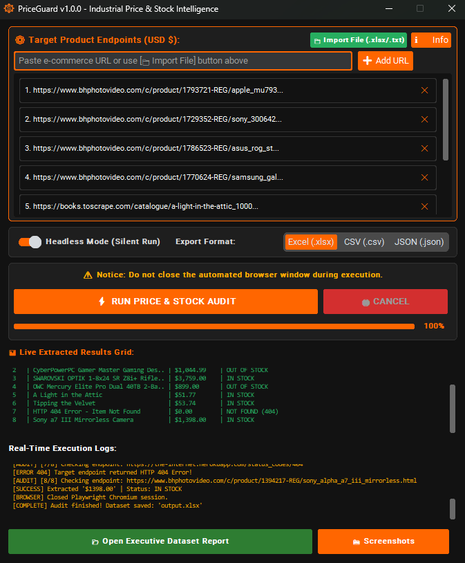
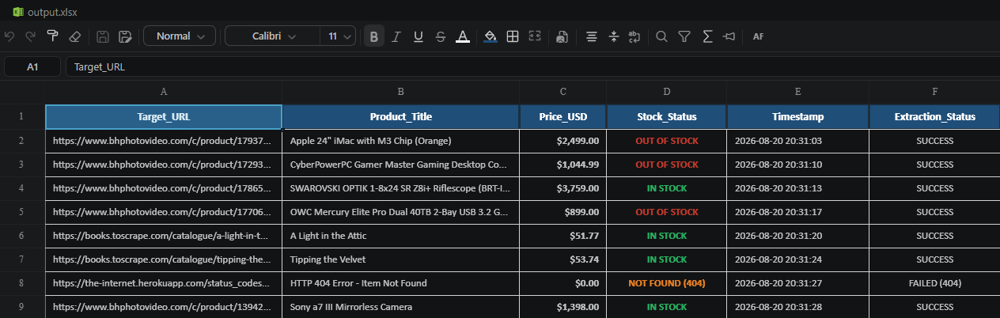

# ⚙️ PriceGuard v1.0.0 | Industrial Price & Stock Intelligence Suite


A production-grade, desktop-based E-Commerce Price & Stock Monitoring application built with **Python**, **Playwright**, **CustomTkinter**, and **OpenPyXL**. Engineered for real-time USD ($) product price extraction, stock status tracking (`IN STOCK` / `OUT OF STOCK`), automated HTTP 404/WAF evidence capturing, and executive Excel report generation.

---

## 🖼️ Industrial Application Interface

### 1. Main Dashboard & Live Data Grid
*Industrial dark-charcoal UI with high-contrast orange accents, multi-threaded execution, and live status grid.*


### 2. Executive Excel Dataset (`output.xlsx`)
*Formatted USD ($#,##0.00) prices, colored stock status flags, auto-fitted column widths, and timestamps.*


---

## 🚀 Key Features

* **Industrial Charcoal/Orange UI:** CustomTkinter dark-charcoal UI with high-contrast orange controls, live execution logs, and live data grid.
* **Universal USD ($) Price Parser:** Extracts real-time USD prices via Open Graph meta tags, JSON-LD schema, and DOM selectors.
* **Stock Availability Flags:** Explicitly identifies `IN STOCK` vs `OUT OF STOCK` status across product pages.
* **404 & Error Evidence Capture:** Gracefully handles broken URLs (HTTP 404) without crashing, recording `NOT FOUND (404)` in Excel and saving evidence screenshots to `/screenshots`.
* **Multi-Format Export:** Generates executive-styled Excel (`.xlsx`), CSV, or JSON datasets with 1-click Explorer integration.
* **Bulk File Import:** Load 100s of product URLs directly from `.xlsx` or `.txt` files with 1 click.
* **1-Click Windows Executable:** Compiled via PyInstaller into a standalone `.exe` for instant execution.

---

## 📁 Modular Architecture

```text
PriceGuard/
├── config/                  # System configuration, portal URLs, and saved targets
│   ├── config.json          # Default runtime parameters
│   └── saved_urls.json      # Persistent user target URLs
├── src/                     # Core application source code
│   ├── gui.py               # CustomTkinter industrial dashboard UI
│   ├── scraper.py           # Playwright extraction engine & WAF bypass
│   └── utils.py             # OpenPyXL Excel styling, logging, & file I/O
├── assets/                  # UI icons & documentation screenshots
├── logs/                    # Audit logs (app.log)
├── screenshots/             # Timestamped failure evidence captures
├── main.py                  # Root application entry point
├── bump_version.py          # 1-Click Semantic Version Bumper
├── requirements.txt         # Package dependencies
├── START.bat                # Windows launcher
└── README.md                # Technical documentation
```

---

## 📊 Executive Excel Dataset Structure (`output.xlsx`)

| Column Name | Description | Example Value |
|---|---|---|
| `Target_URL` | Monitored Product Endpoint | `https://www.bhphotovideo.com/c/product/...` |
| `Product_Title` | Clean Product Name & Model | `Apple 24" iMac with M3 Chip (Orange)` |
| `Price_USD` | USD Formatted Price (`$#,##0.00`) | `$2,499.00` |
| `Stock_Status` | Availability Flag | `IN STOCK` / `OUT OF STOCK` / `NOT FOUND (404)` |
| `Timestamp` | Execution Date & Time | `2026-08-20 15:15:08` |
| `Extraction_Status` | Pipeline Audit Status | `SUCCESS` / `FAILED (404)` |

---

## 🛠️ Quick Start Guide

### 1. Prerequisites
Ensure **Python 3.10+** is installed on your Windows system.

### 2. Install Dependencies
Open Command Prompt or PowerShell in the project directory and run:
```bash
pip install -r requirements.txt
playwright install chromium
```

### 3. Launch Application
Double-click **`START.bat`** or run via terminal:
```bash
python main.py
```

---

## ⚙️ Configuration (`config.json`)

Runtime settings can be adjusted directly in `config.json`:

```json
{
    "app_version": "v1.0.0",
    "currency": "USD",
    "headless": false,
    "input_excel": "input.xlsx",
    "output_excel": "output.xlsx",
    "browser_timeout_ms": 15000
}
```

---

## 📄 License
Copyright (c) 2026 **Lep1n**. Licensed under the **MIT License**.